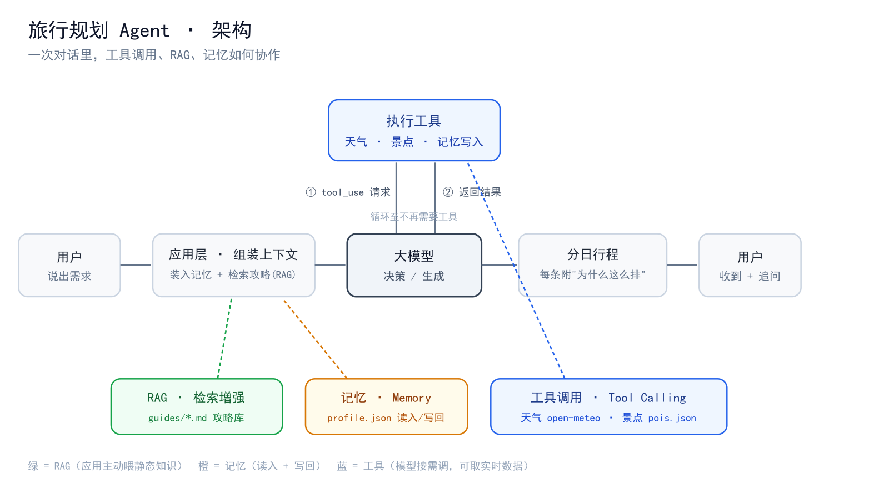
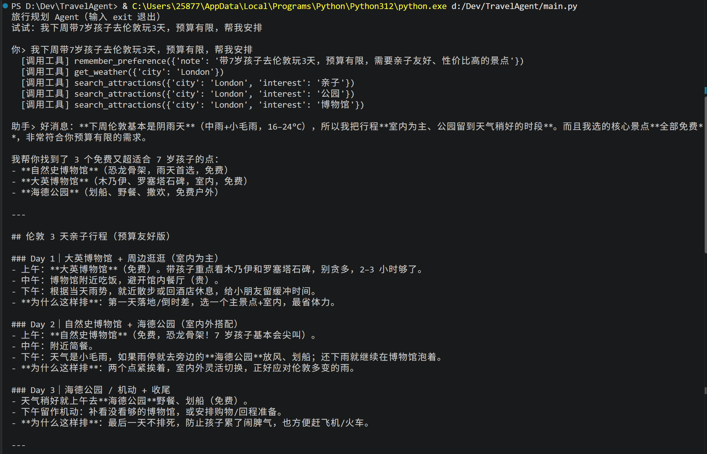

# 旅行规划 Agent · 一版能改的旅行底稿

> 市面上的旅行 AI 大多在回答「这座城市有什么好玩」，却很少回答「我带着孩子、预算有限、只有三天，到底该怎么排」。
> 这个项目专注后者——用自然语言说清需求，它给你一份**懂约束、可执行、还能接着改**的行程底稿。

一个从 0 到 1 独立设计并实现的**对话式旅行规划 Agent**：不只是聊天，而是会**查真实数据、做确定性计算、记住你、随时应变**。

## ✨ 它能做什么

- 🧭 **对话式规划**：一句话说需求，给出带理由的分日行程
- 🎭 **多画像**：独行 / 情侣 / 带娃 / 银发 / 商务 / 特种兵，策略各不同
- 🚩 **个人红线**：怕早起、恨排队、一天最多 N 个点… 当成硬约束守住
- 😌 **精力节奏**：给每天标「强度」，不把累的活动堆在一起
- 💰 **预算护栏**：估算花费、控制在预算内，还能一键「再省点」
- 🗺️ **真实路线优化**：按经纬度算最省脚程的顺序（全局最优），任意城市都能算
- ♻️ **随时应变**：路上说「下雨了 / 航班延误」，行程自动重排
- ✏️ **可编辑底稿**：行程是结构化卡片，能删、能锁 🔒已订、能让 AI 重排、能导出（TXT / PDF）
- 🧠 **跨会话记忆**：记住你的偏好，越用越懂

## 🧠 它和「套壳 ChatGPT」的区别

大模型（ChatGPT）有三个硬伤：**不知道真实数据、算数不可靠、不能动手**。这个 Agent 把这三块补上：

| 能力 | 它怎么做 | ChatGPT 做不到的点 |
|---|---|---|
| 工具调用 | 主动调用天气(open-meteo)、景点查询 | 拿到**实时**、真实的数据，而不是编 |
| 确定性计算 | 用经纬度 + 算法算**最优路线和步行距离** | 空间优化/算数它算不准 |
| RAG 检索 | 从攻略库检索并注入，答案**有出处** | 减少凭空发挥 |
| 记忆 | 偏好落盘、跨会话保留 | LLM 天生无状态 |

> 一句话：**模型是「会理解会表达的大脑」，真实数据、精确计算、持久记忆——这些它天生做不到的，用工具和记忆补上。这就是 Agent 和 ChatGPT 的分界。**

## 🏗️ 架构



一次对话里：应用先装入[记忆]并检索[攻略(RAG)] → 大模型决策 → 按需请求[工具] → 应用执行、回传 → 生成带理由的行程。

## 🖼️ 截图



*一句需求 → 模型自主调用记忆 / 天气 / 景点检索等工具 → 输出带理由的行程（网页版界面运行后自见）。*

## 🚀 本地运行

```bash
pip install -r requirements.txt
cp .env.example .env      # 填入你的模型 API key（DeepSeek / 任意 OpenAI 兼容接口）
python app.py             # 打开 http://127.0.0.1:5000
```

模型调用采用 **OpenAI 兼容接口**，换厂商只改 `.env` 三个变量，不改代码（避免厂商锁定）。

## 🔒 局限与下一步（诚实）

这是个人原型，**不是成熟产品**。已知局限：

- **数据**：景点库很小；价格 / 开放时间 / 余票是静态或缺失——出发前请以官方为准；没有真实预订闭环。
- **路线**：用直线距离近似，未接真实步行 / 公共交通时间。
- **工程**：单机演示，有基础限流与每日额度上限，但非生产级；无账户体系。

**下一步**：接真实 POI / 价格 / 库存数据，打通「规划 → 预订」闭环——而这些正需要平台级的数据与基建。

---

*作者：周艳蓉 · 技术栈：Python、Flask、OpenAI 兼容大模型接口、TF-IDF 检索、open-meteo、OpenStreetMap。附完整 [PRD](PRD.md)。*
